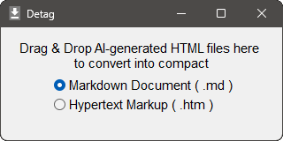

# Detag Version 1.0.0.830

AI が出力したムダにデカい HTML ファイルを小さくまとめます.

Microsoft&reg; の [Copilot](https://copilot.microsoft.com/) さんとか
Google&reg; の [Gemini](https://gemini.google.com/) さんとか, 
何か検索しているといつの間にか AI さんとの会話で盛り上がっていた, なんてことはありませんか?
 
で, その会話がなかなか有用な展開になったので, 保存しておいたことってありませんか?
 
そして, その保存されたファイルのあまりのデカさに驚いたことってありませんか?

それほど長時間会話を続けていた覚えはなくても,
いざセーブしてみると,

* `保存した会話.html` が MB 単位 ( 1000 KB 単位 ) の容量
* 付随する `保存した会話_files` の中身を合計すると `.html` に匹敵するかそれ以上の容量

なんてことも珍しくありません.

ブラウザーに表示されている文字数から考えると,
どう見ても不当にデカいサイズです.
なんでそんなにデカいのでしょう?

ドライブの容量を無駄遣いして OneDrive&reg; の課金へと導くためでしょうか?
いえ, そうではありません. いや, 全く否定できるかというと少し考え込んでしまいますが,
そんなビジネス上の理由ではなく, 生成 AI のデータ表現上の理由があるんだそうです.
おおざっぱに言うと

* 動的な [DOM](https://ja.wikipedia.org/wiki/Document_Object_Model)
を無理やり静的なスナップショットに落とし込んでいるから

だそうで, 動的な状況を裏で演出していた周辺データを丸ごと保存しているのが敗因だそうです.
裏のデータなので実際にやり取りされていたテキストとは関係ありません.
なのでテキストの容量とは無関係にデカいんです.
 (
ちなみに, この DOM うんぬんといった技術的な理由を引き出すためには, かなり会話を重ねて AI を問い詰める必要がありそうです.
)

で, そんなデカい `.html` ファイルから会話部分のテキストだけを選りすぐって,
コンパクトにまとめたファイルにセーブし直してくれるのが本アプリです.

下記の AI の出力に対応しています.

| AI | サイト |
| --- | --- |
| Copilot | https://copilot.microsoft.com/ |
| Gemini web app | https://gemini.google.com/ |
| Google AI Overviews[^1] | https://www.google.com/ |

[^1]: “[AI Overviews](https://en.wikipedia.org/wiki/AI_Overviews)”
は Google で検索していると横から口を出してくるアレの正式名称だそうです. 
どこの AI かを名前に含めていないところが唯我独尊的な視野の狭さを感じますが, 
そのまま呼ぶと混乱を招くので本アプリでは一貫して“*Google* AI Overviews”と呼ぶことにします.

## [効能](#readme)

本アプリの機能はだいたいこんな感じです.

* オリジナルの `.html` の中から, あなたからの質問と AI からの回答のテキストだけをピックアップする. 
( なので容量が激減する. )

* テキスト以外に画像が挟まっていたとしても, それらは省略する. 
( なので画像などを収めている `_files` フォルダは削除して構わない. )

* テキスト以外に挟まっていた紹介記事のリンクは, 全て温存する. 
( なので画像を削除したあとも, リンクをたどればまた画像は見られる. )

* オリジナルの視覚効果頼りの表現を, 質実剛健なテキスト表現に変更する. 
( なので <kbd>Ctrl</kbd>+<kbd>F</kbd> で検索とかしやすくなる. )

* 一部が隠れた状態でセーブされた[^2]オリジナルでも, 全部読めるよう展開する. 
( なので「あー! しまったぁー!」という状況から抜け出せる. )

[^2]: Copilot は最後までスクロールした状態でセーブすると, そのセーブファイルからは最後のページしか見えません.
スクロールアップしても広大な空白が広がるだけです.
セーブする前に一旦最初のページまでスクロールアップしておけば避けられるのですが,
つい忘れがちです. というかめんどくさいです. 
Gemini web app は, ユーザーからの質問文は冒頭の 2行程度で以下省略するのがデフォルトです.
このデフォルト表示のままセーブすると省略された部分を見返すことはできません.
セーブする前に一度全ての質問文を開いて回れば避けられるのですが,
つい忘れがちです. というかめんどくさいです.

オリジナルをどういうかたちで残すかについては,
上述のように「コンパクトで扱いやすい」を心掛けました.

> [!NOTE]
> どれくらいコンパクトにまとまるのかというと,
ある会話を Microsoft Edge&reg; でセーブした例では 
本体 `.html` のサイズが `3.47 MiB` のところ,
出力 `.htm` のサイズが `91.3 KiB` まで圧縮されていました. 
この例の場合, 元容量の 2.57% にまで減ったということになります.
 (
逆に言えば 97.43% が不要だったということですが.
) 
Mozilla Firefox&reg; でセーブした場合は,
Microsoft Edge&reg; のように馬鹿げたサイズにはなりませんが,
それでも相応に大きなファイルになります.
こちらの例では `571 KiB` が `77.1 KiB` で 13.51% でした.

## [形式](#readme)

コンパクトにまとめた後のファイルの中身は,
不要なタグを極限まで剥ぎ取った [HTML](https://ja.wikipedia.org/wiki/HyperText_Markup_Language) です.
 (
「Detag」の名前はそこから来ています. 単に実験ツールのつもりで付けた心のこもっていないネーミングでした.
)

出力ファイルとして,
マークダウン形式 ( `.md` ) とハイパーテキストマークアップ形式 ( `.htm` ) の 2タイプが選べるようになっていますが,
いずれを選んでも中身は一緒です.

つまり「[マークダウン](https://ja.wikipedia.org/wiki/Markdown)」と言っておきながら,
中身は「[マークアップ](https://ja.wikipedia.org/wiki/マークアップ言語)」なんです.
`.md` を[レンダリング](https://ja.wikipedia.org/wiki/レンダリング_(コンピュータ))するソフトは, 同時に
`.htm` をレンダリングできるソフトでもあるので,
中身が一緒でも問題ありません.
「本格的な [HTML](https://ja.wikipedia.org/wiki/HyperText_Markup_Language)
を書くのがめんどくさい人間が書くのが
[Markdown](https://ja.wikipedia.org/wiki/Markdown)
であって,
最初から [HTML](https://ja.wikipedia.org/wiki/HyperText_Markup_Language)
で書かれているものをわざわざ
[Markdown](https://ja.wikipedia.org/wiki/Markdown)
に落とす必要はない。」というのが本アプリのスタンスです.
 (
本格的に [Markdown](https://ja.wikipedia.org/wiki/Markdown) に変換するとなると,
「どの[方言](https://qiita.com/gaichi/items/1d41c48c60579df0aeec)で表現するか」という派閥論争に巻き込まれてまうっちゅうもんやし.
)

本アプリとしては同じ変換結果を

* そのままファイルに落としたものを `.md` 形式
* 前後に HTML のヘッダーやフッターを付け加えたものを `.htm` 形式

としてセーブしているだけです.
 (
`.htm` という拡張子が[古臭い表現](https://ja.wikipedia.org/wiki/8.3形式)であることは認めますが,
オリジナルの `.html` を上書きしないために引っ張り出してきました.
)

拡張子の前のファイル名はオリジナルと同じで,
`保存した会話.html` からは `保存した会話.md` または `保存した会話.htm` が,
オリジナルが置いてあったのと同じフォルダーにセーブされます.

ファイル形式の詳細については[こちら](./docs/Format.md)をご参照ください.

## [操作](#readme)

使い方は下記のように簡単です.

1. 起動すると冒頭に掲げたようなダイアログが出てくる.
1. `.md` か `.htm` かを選ぶ.
1. 変換したい `.html` をダイアログに Drag & Drop する.
1. ダイアログを閉じる.
1. オリジナルの `.html` を削除する. ( 特に未練がなければ )
1. `.html` に[接続](https://learn.microsoft.com/ja-jp/windows/win32/shell/manage#connected-files)していた `_files` も消えている. ( 特に削除したわけでもないのに )

※ 上記 5. と 6. はお好みですが, やっておくと容量の節約になって OneDrive&reg; の課金を遠ざけられます.
( まだ言うか. )

* 複数のファイルをつかんでいっぺんに Drop すると, 全部のファイルを取り扱います.
* `.html` じゃないファイルを Drop してもなにもしません.
* Copilot さんや Gemini さんのものではない
`.html` を Drop してもなにもしません.

## [環境](#readme)

* Visual Studio 2022&reg; での Windows&reg; 11 向け build なので, 64bit OS 用です.
* 同じ build で Windows&reg; 10 でも問題なく動作しますが, 64bit 版に限ります.

## [導入](#readme)

ここは GitHub です.
GitHub というのは「ソースを置いとくから自分でビルドとかしてね。」を旨とする人々の集うところであって,
「ごちゃごちゃ言わんと実行できるファイルで寄越さんかい！」という要求はスジ違いというものです.

ですが,
いちおう「インストーラー」として用意したものが,
本ページ右上の「[Releases](../../releases)」というコーナーに上げてあります.
でも, それをダウンロードする前に,
せめて[インストール手順](./docs/Installation.md)をご一読ください.
あなたの危険な行為を阻止すべく, 色々と Windows&reg; が説得してくるはずなので,
どうやってそれらを振り切って初志貫徹するかが書いてあります.

## [注意](#readme)

そもそも,

* こんなアプリを公開してもいいのか
* このアプリで抽出した情報は公開してもいいのか

という懸念を Copilot さんと Gemini さんにぶつけてみたところ,
返ってきた回答が以下の通りです.

* [Copilot さんからの回答](./docs/Detag.Copilot.md) ( 2026年8月現在 )
* [Gemini web app さんからの回答](./docs/Detag.Gemini.md) ( 2026年8月現在 )
* [Google AI Overviews さんからの回答](./docs/Detag.Google.md) ( 2026年8月現在 )

アプリの公開は問題なさそうなのでこうして公開しています.
 
抽出した情報の公開については注意事項があると仰せなので,
公開前に上記の回答をご一読ください.

> [!IMPORTANT]
> この「ご一読ください」を添えたことにより当方は注意喚起の責任は果たしたものとし, 
あなたが違法行為を犯したとしても「知らんがな」と主張するものであります.

> [!CAUTION]
> ブラウザーに Microsoft Edge&reg; や Google Chrome&reg; をご愛用のみなさまにお知らせです. 
AI との会話をセーブするなら,
ブラウザーには Microsoft Edge&reg; や Google Chrome&reg; ( 同じ Chromium 系 ) ではなく
Mozilla Firefox&reg; を使う方が安全だそうです.
セーブ時に落とした「断片化したオブジェクト」が,
Microsoft Defender&reg; により「脅威 ( threat )」だと誤判定される場合があるからです.
特に [Copilot](https://copilot.microsoft.com/) との会話はそうなりやすいそうです.
( 2026年8月現在 ) 
詳しくは[この件に関する Copilot さんからの見解](./docs/Allow.Copilot.md)をご参照ください.

In-house Tool / 家中 徹

