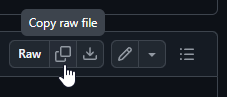
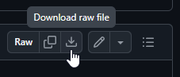
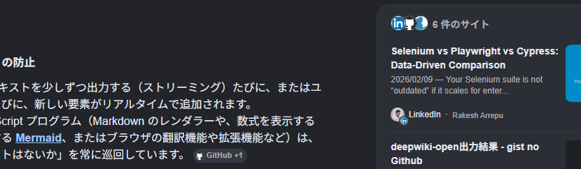

# ファイル形式

本アプリが出力するファイルの内容を確認するには,
実例として上げられている
[Detag.Copilot.md](./Detag.Copilot.md) や
[Detag.Gemini.md](./Detag.Gemini.md) を見に行って,
そのページの右上の方にある下記のアイコンをつついて生のファイルイメージを
Copy してからお手許のエディターに Paste したり,<br>
<br>
同じく下記のアイコンをつついて生のファイルをダウンロードしてからお手許のエディターで開いたり,<br>
<br>
とすれば生きた実例が見られます.

> [!IMPORTANT]
> ブラウザー上で右クリックメニューから直接「ページのソースを見る」のを試みても,
`.md` が HTML 変換されたややこしいイメージが見えるばかりです.
「生のファイル」として見てください.


## ファイル構成

たとえば
[Detag.Copilot.md](./Detag.Copilot.md) を例にとると,
その出だしは下記のように始まっていますが――

<blockquote>
<hr>
<h5>
You said
</h5>
<table><tr><td>
AI との会話を browser で Save as した .html ファイルがアホみたいにデカいので,<br>
会話のテキストだけ抽出してコンパクトな .htm ファイルにまとめるツールを作った.<br>
このアプリって, ソースコードで公開して問題ないのかな?<br>
あと, このアプリで抽出した会話って, ネットで公開して問題ないのかな?</table>
<h6>
Copilot said
</h6>
<p>
結論だけ先に言うと 
<strong>
あなたのツールは「ソースコード公開OK」
</strong>
 で、
<strong>
抽出した会話の公開は “内容次第でOKにもNGにもなる”
</strong>
 という整理になる。
</p>
<p>
以下、理由を体系的にまとめる。
</p>
</blockquote>

―― `.md` ファイルの生のイメージは, 下記のように始まっています.

<blockquote>

```
<hr>
<h5>
You said
</h5>
<table><tr><td>
AI との会話を browser で Save as した .html ファイルがアホみたいにデカいので,<br>
会話のテキストだけ抽出してコンパクトな .htm ファイルにまとめるツールを作った.<br>
このアプリって, ソースコードで公開して問題ないのかな?<br>
あと, このアプリで抽出した会話って, ネットで公開して問題ないのかな?</table>
<h6>
Copilot said
</h6>
<p>
結論だけ先に言うと 
<strong>
あなたのツールは「ソースコード公開OK」
</strong>
 で、
<strong>
抽出した会話の公開は “内容次第でOKにもNGにもなる”
</strong>
 という整理になる。
</p>
<p>
以下、理由を体系的にまとめる。
</p>
```
</blockquote>

上記冒頭部分の構成要素は,
本アプリが独自に付け加えているものです.

* 冒頭の `<hr>`:<br>
一つの質疑と次の質疑との間を視覚的に区切るために挟んでいます.

* `<h5>` と `</h5>` で挟まれた `You said`:<br>
Copilot さんが出力するイメージに元々入っている文言です.
ただ, その出力を直接ブラウザーで眺めている際には隠れていて見えません.
<kbd>Ctrl</kbd>+<kbd>F</kbd> とかして頭出しの検索に便利なので,
本アプリではこの文言が露出するように調整しています.<br>
このような文字列を仕込んではこない Gemini さんの出力を扱う場合も,
わざわざ同じ文言を挟むようにして取り扱いの共通化を図っています.

* `<table>` と `</table>` で囲まれたユーザーからの質問文:<br>
ユーザー側がどういう質問をぶつけたのかを視覚的に見つけやすくするために囲っています.<br>
オリジナルでは「右側に寄せた独自背景色の矩形の中に納める」というチャットツールのような視覚効果を持たせていますが,
なんかスペースがもったいないのでこのように改めました.

* `<h6>` と `</h6>` で挟まれた `Copilot said`:<br>
Copilot さんが出力するイメージに元々入っている文言です.
ただ, その出力を直接ブラウザーで眺めている際には隠れていて見えません.
<kbd>Ctrl</kbd>+<kbd>F</kbd> とかして頭出しの検索に便利なので,
本アプリではこの文言が露出するように調整しています.<br>
このような文字列を仕込んではこない Gemini さんの出力を扱う場合も,
同じ文言をわざわざ挟むようにして共通化を図っています.<br>
Gemini さんの場合は当然 `Gemini said:` と挟まります.
本アプリを通すと, いずれの AI の出力も統一感のあるデザインに落ち着くので,
この部分を見てどっちの AI との質疑なのかを見分けたりします.

それ以降の部分は,
オリジナルの出力から必要な部分だけを抽出した HTML そのものが入っています.

どのように抽出を行っているかというと,
以下のような処理に基づいています.

#### 共通処理:

* 以下の会話に無関係なタグを下表のように剥ぎ取る.<br>
	| エレメント | どこまで剥ぎ取るか | 削除される範囲 |
	| --- | --- | -- |
	| `button`	| `</button>`	| `<button>` から `</button>` まで丸々削除. |
	| `hr`		| `>`		| `<hr>` だけ削除. |
	| `label`	| `</label>`	| `<label>` から `</label>` まで丸々削除. |
	| `input`	| `>`		| `<input>` だけ削除. ( `</input>` なんてないし. ) |
	| `script`	| `</script>`	| `<script>` から `</script>` まで丸々削除. |
	| `section`	| `>`		| `<section>` だけ削除して中身は温存. |
	| `/section`	| `>`		| `</section>` だけ削除して中身は温存. |
	| `style`	| `</style>`	| `<style>` から `</style>` まで丸々削除. |
	| `svg`		| `</svg>`	| `<svg>` から `</svg>` まで丸々削除. |

	`>` までを剥ぎ取るのはそのタグだけが要らない場合で,<br>
	`</...>` まで剥ぎ取るのは, そのタグで囲まれた部分全体が要らない場合です.

#### Copilot 専用処理:

* `<main>` に遭遇したら, そこから出力を開始する.<br>
その前にあるあれやこれやは, 質疑内容には無関係の初期設定の類に決まっているので.

* `</main>` に遭遇したら, そこで抜ける.<br>
その先にあるあれやこれやは, 質疑内容には無関係のオマケの類に決まっているので.

* `<h5>` に対しては `>` までを一旦剥ぎ取った上で [Copilot 専用調整処理](#copilot-専用調整処理)を実施.<br>
Copilot さん的に `<h5>` を出してきた場合,
それはユーザーの質問文の始まりを示すので,
その手前の Copilot さんの回答を整理していろいろ調整するタイミングなんです.

* `<div>` に対しては `>` まで剥ぎ取った上で以下を実施:<br>
`</div>` のネスト数をカウント中の場合は `+1` する.<br>
Gemini さんが `<div>` に対していろいろなオマケを載せてくるので,
専用処理を構えざるを得ないのですが,<br>
Copilot さんの方は単に「じゃない方」として切り分けられているだけで,
やっていることは一般的です.

* `<span>` に対しては以下を実施:<br>
	* `class="block"` を含む場合は `</span>` までを剥ぎ取る.<br>
Copilot さん的に `<span>` に `class="block"` を載せてきた場合,
それは質疑とは無関係な注釈文なんです.
	* その他の場合は, 普通に `>` までを剥ぎ取る.

#### Gemini 専用処理:

* `<h2>` に対しては `</h2>` までを丸々剥ぎ取った上で [Gemini 専用調整処理](#gemini-専用調整処理)を実施.<br>
そして `<hr>\r\n<h5>\r\nYou said\r\n</h5>\r\n` を挟む.<br>
Gemini さん的に `<h2>` を出してきた場合,
それはユーザーの質問文の始まりを示すので,
Copilot さんと同じになるよう目印のテキストを挟んでおきます.<br>
ここで `<h2>` から `</h2>` まで丸々剥ぎ取ってしまっては,
元の質問文が失われないかと疑問に思われるかもしれませんが,
`<h2>` で囲まれているテキストは　Gemini さんの都合で目印として挟んでいるものらしく,
ユーザーに見せるための本当のテキストはこのかなり先に `<span>` で囲まれて再登場します.
<br><sup>( 
こういうことをやっているからムダにデカいんですよ…….
)</sup>

* `<div>` に対しては以下を実施:<br>
	* `<div>` の中に以下の属性を含む場合は, 次の `</div>` まで丸々剥ぎ取る.<br>
		* `style="display: none"`	( 表示対象ではないので )
	 	* `role="dialog"`		( ダイアログ内のテキストなので )
		* `role="button"`		( ボタンのテキストなので )
		* `aria-hidden="true"`		( 隠された [ARIA](https://ja.wikipedia.org/wiki/WAI-ARIA) なので )
	* 上記の属性を含んでいない場合は,
	`>` まで剥ぎ取る.
	* `<div>` のネスト数をカウント中の場合は `+1` する.
	* カウント中でなく `role="heading"` の属性を含む場合は:
		* `aria-level="3"` を含む場合は「見出し」ということなので<br>
		改行を挟んだ上でフォントを少し大きくし,
		`<div>` のネスト数カウントを開始する.<br>
		( 同階層の `</div>` でフォントを戻さないとならないので. )
		* `aria-level="4"` を含む場合は「番号付きのリスト」ということなので<br>
		改行を挟むだけでフォントを大きくしたりはしない.<br>
		( そこまで強い heading でもないので. )

* `<span>` に対しては `>` まで剥ぎ取った上で以下を実施:<br>
	* `role="heading"` の属性を含む場合は:
		* まだ出力を開始していなかったら, ここで開始する.
		* `<span>` の中に `aria-level="1"` を含んでいたら,<br>
		それはユーザーの質問文の始まりを示すので,<br>
		[Gemini 専用調整処理](#gemini-専用調整処理)を実施してから,
		出力に `<h5>\r\nYou said\r\n</h5>\r\n` を追加.

	* `data-key="aimhl"` の属性を含む場合は:<br>
		* Gemini さんの回答文の始まりを示すので,<br>
		出力に `<h6>\r\nGemini said\r\n</h6>\r\n` を追加.

	* `aria-hidden="true"` の属性を含む場合は:<br>
		* `<span>` の次のテキストが `&nbsp;` だけだったら,<br>
		それは改行が入るべき箇所を示すので `<p></p>\r\n` を出力に追加.
		* いずれにせよ同階層の `</span>` までを剥ぎ取る.

> [!NOTE]
> 「ユーザーの質問文の始まりを示す」目印が 2パターン ( `<h2>` と `aria-level="1"` を含む `<span>` ) あるのが,
なんとも言いがたいところですが, ホントにこうなっているので仕方ありません.
今後もう少し整理されるのを期待しておきましょうか. <sub>( 2026年8月現在 )</sub>

> [!TIP]
> `data-key="aimhl"` の `aimhl` は自動生成された変数名などではなく,
<b>AI</b> <b>M</b>essage <b>H</b>ead <b>L</b>ine という Gemini さん固有のキーワードで,
AI が生成したメッセージの開始点を示すマーカーだそうです.
なので本アプリのようなスクレイピング処理での目印としてアテにしてもだいじょうぶだと,
Gemini さんご本人がおっしゃってました.

#### Copilot・Gemini 共用処理:

* `<textarea>` に遭遇したら, そこで抜ける.<br>
オリジナルの出力を直接ブラウザーで眺めている際には隠れていて見えませんが,
最後にユーザーからの反応を記入するためのテキスト入力欄が設けてある場合があります.
この欄より先には質疑に関係するテキスト成分は出てこないことが判っているので,
遭遇したらそこで抜けることにしています.

* `<code>` に対しては以下を実施:
	* `<code><pre>` と並んでいる場合はソースコードの紹介で,<br>
	直上に載っているテキストは言語の名前を紹介するもの.
	これを少し小さいフォントに調整.
	* `<code>` から `</code>` の中に挟まっているコメント ( `<!--` から `-->` の間のテキスト ) は全削除.
	* `<code>` の中の引数 ( `<code ` から `>` の間のテキスト ) は全削除.
	* `<code>` から `</code>` の中に挟まっている `<span>` ( `<span` から `>` の間のテキスト ) は全削除.
	* `<code>` から `</code>` の中に挟まっている `</span>` ( `</span` から `>` の間のテキスト ) は全削除.
	* `<code><pre>` と並んでいない場合は出力テキストを読みやすくするため, そこに改行を挟む.

* `</div>` の場合は `>` まで剥ぎ取った上で以下を実施:<br>
`</div>` のネスト数をカウント中の場合は `-1` して,<br>
ちょうど `0` に達した場合は出力に `</div><p><p>\r\n` と加える.<br>
開いた `<div>` を同じ階層で閉じて少し行間を空けるため.

* `</span>` の場合は `>` まで剥ぎ取るだけ.<br>
上記「会話に無関係なタグ」と一緒にまとめず個別処理しているのは,
`<div>` 同様の「同一階層で閉じる処理」が必要になったときに備えて.
( 今のところその必要はなさそうだが. )

* その他のタグの場合は以下を実施:<br>
`<a>` に対してはとりあえず何もせず温存.<br>
`` に対してはタグ全体を剥ぎ取った上, `alt=` として添えられていたテキストに差し替え.<br>
その他に対してはタグ全体を剥ぎ取る.

#### Copilot 専用調整処理:

質疑 1ターンごとに 1回ずつまとめて行う調整です.<br>
なので Copilot さんとの会話においてユーザーの質問文の前に挟まる `<h5>` が現れるたび,<br>
そしてオリジナルを最後まで読み切ったときにもう一度最後の質疑を振り返るために行います.

その処理内容は以下の通りです.

* 冒頭に `Today` とだけ書いてあったら, それは削除.<br>
なぜか Copilot さんは会話の冒頭にそういうテキストを置いておくんですよ.
<br><sup>( 
日時で表現しておいてくれたらいつの言い分かあとからも判って便利だと思うんですが, なぜ `Today` 固定?
)</sup>

* これまでの出力の最後が `</a>\r\n` で終わっていたら,<br>
ひと質疑終わったところで挟んでくる関連サイト紹介欄を以下の要領で整理:
	* まずは出力の最後にリストを締めくくる `</ul>\r\n` を追加.
	* 出力をさかのぼって `<a` を検索.
	* 見つからなかったら抜ける.
	* `<a` の後ろに置かれている情報源のサイト名が `<p>` と `</p>` で囲まれているので抽出.
	* `href=` の後ろに置かれている URL を抽出.
	* 抽出した情報だけで ( 他のあれこれは捨てて ) `<a … </a>` を作り直す.
	* 元の `<a … </a>` は削除して, 作り直した `<a … </a>` に差し替える.
	* ある分全部差し替え終わったら, そこにリストを始める `<ul>\r\n` を差し込む.

* これまでの出力が空でなければ ( 最初のターンでなければ ) 以下を実施:
	* 最後の `</h5` を検索. ( 質問文の前の `<h5>You said</h5>` の直後狙い. )
	* その直後に置かれているユーザーの質問文を整形して修飾.

* 仕切り線として改めて `<hr>\r\n` を出力に追加.

* 最後のターンでなければ, 次のターンの頭として `<h5>\r\n` を出力に追加.


#### Gemini 専用調整処理:

質疑 1ターンごとに 1回ずつまとめて行う調整です.<br>
なので Gemini さんとの会話においてユーザーの質問文の前に挟まる `<h2>` が現れるたび,<br>
または `aria-level="1"` を含む `<span>` が現れるたび,<br>
そしてオリジナルを最後まで読み切ったときにもう一度最後の質疑を振り返るために行います.

その処理内容は以下の通りです.

* これまでの出力が空でなければ ( 最初のターンでなければ ) 以下を実施:
	* 関連サイト紹介欄を整理 ( 下記参照 ).
	* `>\r\n</a>` つまり中身が空っぽの `<a … </a>` を検索.<br>
	( 文中に挟んだリンクを Gemini さんはそう表現するので. )
	* 見つからなかったら抜ける.

関連サイト紹介欄の整理は下記の要領で行います.

* `\r\n<ul>\r\n<li>\r\n<a` を検索. 見つからなければ終了.
* 見つかった上記を起点に `<ul>` と `</ul>` を検索.
* `<ul>` が `</ul>` より後ろにあったら終了. ( そういうネストしたリストは紹介欄ではない. )
* 見つかった起点より後ろの出力は削除. ( 古いリスト記述を削除. )
* 見つかった上記を起点に `href=` の後ろに置かれた URL をあるだけ拾う.
* 一つも拾えなかったら終了.
* 新たに出力に `\r\n<ul>&nbsp;\r\n` を追加.
* 拾った URL をオリジナルの HTML 記述から検索して, URL を含む `<li>` から `</li>` を割り出す.
* 割り出した範囲から `<span>` と `</span>` で囲まれたテキストを全て拾う.
* 拾った URL, 最後の `<span>`, 最初の `<span>` を使って `<a … </a>` を作り直す.
* 作り直した `<a … </a>` を `<li>` として出力に追加.
* 全部終わったら出力に `</ul>\r\n` を加えてリストを締めくくる.

> [!TIP]
> リンクにもいろんなタイプがあって図解しないと解りにくいので, 実際のスナップショットを挟んでおきます.

<br>上の図で, <ins>Mermaid</ins> とあるのが文中の通常の `<a …>見出し</a>` によるリンク,<br>
真ん中下端に `Github +1` とあるのが「ソース・チップ」( source chips ) によるリンク,<br>
右端で別枠に収まっているのが, 「シテーション」( citations ) によるリンクということになります.
<br><sup>( 
その “source chips” だとか “citations” だとかを何て呼べばいいのか判んなくて,
Gemini さんに教えてもらいました.
)</sup>


#### 終了処理:

Copilot さんの場合は [Copilot 専用調整処理](#copilot-専用調整処理) を,
Gemini さんの場合は [Gemini 専用調整処理](#gemini-専用調整処理) を呼び出します.<br>
最後の質疑を締めくくるためです.


## 方針

なるべく安直な現物合わせの変換処理にならないよう心掛け,
多少遠回りであっても今後の仕様変更に耐えられるように心掛けたつもりではあります.

が, 何せ日進月歩で進む ( 仕様が変わる ) 入力を相手にしている処理なので,
どこかで想定外 (「ええーっ! コレをそうするのぉ!?」) のことにぶつかるかもしれません.
そうした想定外には牛歩で追従していくつもりではあります.