# インストール手順

[`Releases`](https://github.com/inhouse-tool/Detag/releases)
の下にある最新版をマウスでクリックすると,
その最新版を構成するファイルのリストを紹介する Assets のページが下の絵柄のように開きます.
その中から `Detag.msi` をクリックして, インストールファイルのダウンロードを開始します.

開始した途端,
あなたの無謀な行為
( どこの馬の骨かも判らないやつが作ったインストーラーをダウンロードするなんて！ )
を阻止すべく, Windows&reg; さんがいろいろ親切に抵抗してくるので,
いかにそれらの親切を踏みにじって無謀な行為を完遂するかを,
ここにまとめておきました.

> [!IMPORTANT]
必ず当サイトの [`Releases`](https://github.com/inhouse-tool/Detag/releases)
からご自身で直接ダウンロードした `Detag.msi` をお使いください.
人から USB メモリーや SD カードなどに入ったファイルで渡されたものだと,
それが正規品であるとは保証できません.
また, 正規品を提供しているのは当サイトのみです.
どこにもミラーリング等しておりませんので,
当サイト以外からのダウンロードはやめておきましょう.

## [Microsoft Edge の場合](#installation)

`Detag.msi` をクリックすると,
下記のように諭されます.
一般の人はそんなことはしないそうです.

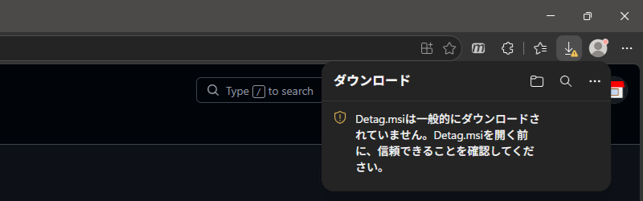

でも, その警告文にマウスカーソルをあてがうと, 下記のように右側に `...` が現れます. 

ここで `その他のアクション` とか出ているのは[ツールチップ](https://ja.wikipedia.org/wiki/ツールチップ)で,
あなたがマウスカーソルをあてがっている `...` に対するヒントを出してくれているものです.
ここで `その他のアクション` にマウスカーソルを当てようとしても,
自分のしっぽを追いかける仔犬のようになるだけです.

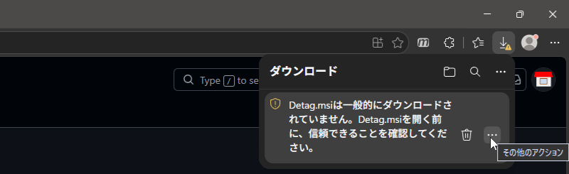

その `...` をクリックすると, 下記のようにポップアップメニューが現われます.

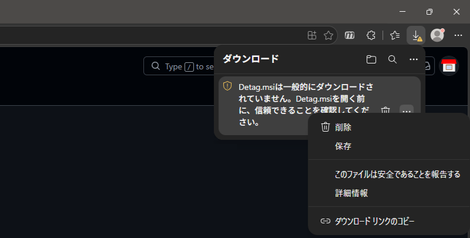

このポップアップメニューで `保存` を選ぶと,

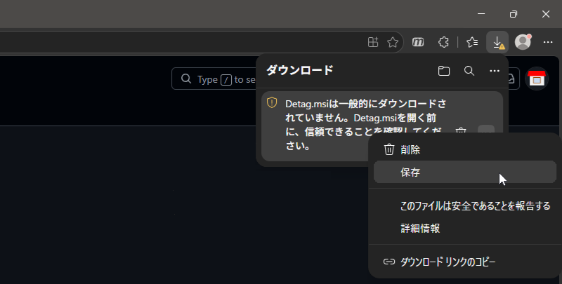

今度は下記のようなダイアログが現われて,

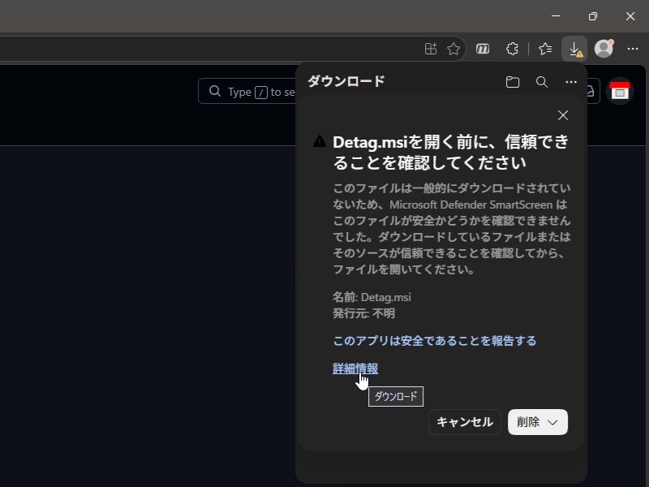

上のように

* `キャンセル`
* `削除`

という後ろ向きな二択を迫ってきます. 

ここで `ダウンロード` とか出ているのは[ツールチップ](https://ja.wikipedia.org/wiki/ツールチップ)で,
これにマウスカーソルを当てようとしても,
自分のしっぽを追いかける仔犬のようになるだけです.

しかし, `削除` のボタンの表示が妙ですね.
その右半分の `˅` とか書いてあるところをつつくとなんか下に出てきそうな気がします
( コンボボックスのアレを連想 ).

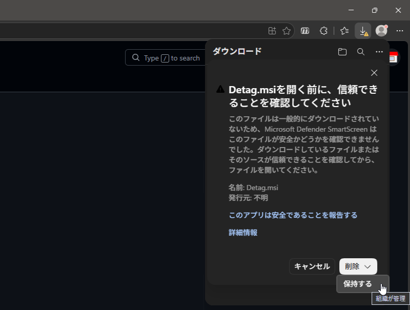

で, `˅` とか書いてあるところをつつくと実際に出てきました.
`保持する` というボタンです.
この `保持する` をクリックすることにより,
ようやくダウンロードが始まります. 

しかし[ツールチップ](https://ja.wikipedia.org/wiki/ツールチップ)に出ている「組織が管理」って何なんですかね?
特に組織に管理されている覚えは……
はっ! あの Microsoft の悪口を書いているとどこからともなくやってくるという黒い服の二人組,
M.I.B. を派遣してくるという噂の組織, Microsoft Intelligence Bureau が

そしてダウンロードが完了すると,
下記のような表示に改まります.

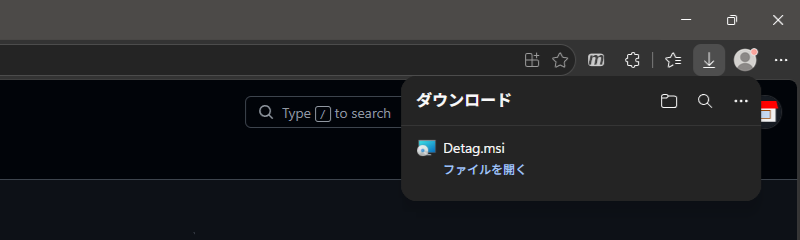

ここで `ファイルを開く` を選ぶとインストーラーが動き出します.
が, ちょっと待ってください.
ダウンロード元が信用できるならそれでもいいのですが,
今回のようなうさん臭い場所から持ってきたファイルは,
動かす前に確認しましょう.

 をクリックしてダウンロードフォルダーを開き,
そこに入っている `Detag.msi` の[確認](#インストーラーの確認)です.

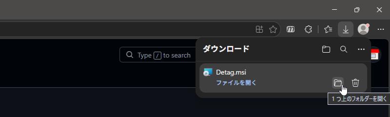

## [Microsoft Edge 以外のブラウザーの場合](#installation)

すみません.
そういうことを言い始めるとキリがないので省略です.
 

( 派閥論争の元になりますからね.
「なぜ█████████████なんて███████を紹介しといて██████████がないんだ！」とか. )

## [インストーラーの確認](#installation)

正規品最新版の `Detag.msi` は, プロパティ―を見ると,
下記のように `2026年8月24日 15:33:43` 付けのデジタル署名が付いています.

まあ, これはいわゆる「自己署名」(「私がやりました。」) というもので,
ちゃんとした認証局が発行した署名 (「あの人がやりました。」) と比べて全然説得力がありません.
ちゃんとした認証局に署名してもらえば, そもそもこんなにダウンロードが面倒ではなくなるのですが,
認証してもらうにもお金がかかるのです.
なので「自己署名」で済ませました.
いえ, 「自己署名」といえど「署名」には違いないのです.
以下の話に耳をお貸しください.

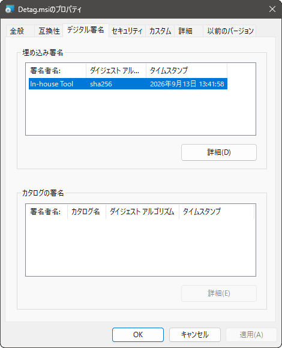

上記プロパティのダイアログの <kbd>詳細(D)</kbd>
ボタンをクリックして詳細を見てみましょう. 
下記のようなダイアログが現れるはずです.

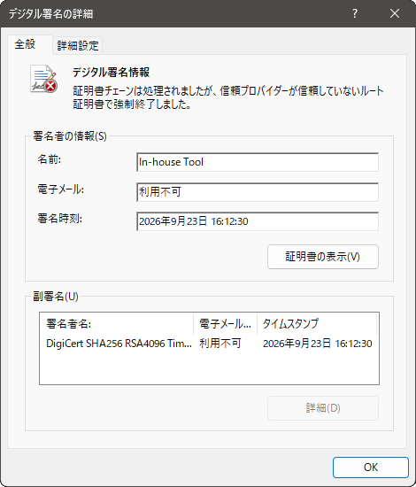

これをどう読み解くかというと,

* 署名者である `In-house Tool` とやらが署名を施したのが
`2026年8月24日 15:33:43`
* この署名に立ち会った `DigiCert` が副署名を施したのも
`2026年8月24日 15:33:43`

と, 両者の日時が一致しています.
上記 1. だけなら署名者が自分の PC の時計をいじくって日時を捏造することも可能かもしれませんが,
この署名に立ち会った `DigiCert` ( フルネームは `DigiCert SHA256 RSA4096 Timestamp Responder 2025 1` )
の時計までいじることは不可能です.
なので, この署名がここに書かれた日時に行われたということは間違いないでしょう.

とすると, 過去にさかのぼれるタイムトラベラーでもない限り,
同じタイムスタンプの署名を施すことは不可能なので,
同じ日時が書いてあったら,
それは署名者が出したオブジェクトと同じものだと判断できます.
なので, あなたがゲットした `.msi` の署名も同様に確認してみましょう.

日時が
`2026年8月24日 15:33:43`
に一致していたらそれは正規品です.
ソースを開示している原作者 `In-house Tool` が, その本人しか書き込めないこのページ上でこうして
`2026年8月24日 15:33:43`
だと明言しているのですから, 間違いありません.

> [!NOTE]
> 今一度論点を整理すると:
> 
> 1. 署名 ( <ins>S</ins>ignature ) の署名時刻 ( Sigining time )
と副署名 ( Co<ins>u</ins>ntersignatures ) のタイムスタンプ ( Timestamp ) が同じ日時.
> 1. その同じ日時が署名者にしかできない方法で宣言されている.
>
> この 2 条件が成立している場合,
その署名されたブツは署名者が出したものであり, 誰も改ざんしていないと判断できるということです.

ということで「自己署名」でも,
その署名の「日付」を意識していただければ, 「偽造」の防止効果はあるっちゃあるというお話でした.
 

( 署名者の提供品であることは信頼できても, 署名者自体が信頼できるかどうかは別問題ですからね. 気を付けてくださいよ. )

> [!IMPORTANT]
必ず当サイトの [`Releases`](https://github.com/inhouse-tool/Detag/releases)
からご自身で直接ダウンロードした `Detag.msi` をお使いください.

とか言ってたけど、
直接ダウンロードしたものじゃなくても正規品かどうか判断できるじゃん。
とか考えたあなた.
確かにそれはそうなのですが,
あなたがそう考えたのはこのページの説明をここまでお読みになったからで,
だったらついでにこのページからダウンロードしていけばええんちゃう？
とか考えてもええんちゃう？

* インストールされる `Detag.exe` にも署名があり, `2026年8月24日 15:33:39` となっています.
インストール後にでもご確認ください.

`Detag.msi` が正規品最新版であることを確認しましたか?
では, その `.msi` を実行 ( ダブルクリックとか ) して[インストール](#インストール)を開始しましょう.

## [インストール](#installation)

で, `.msi` を実行 ( ダブルクリックとか ) すると,
インストーラーが動き出す…… 
……前に下記のような「最終防衛ライン」があなたの前に立ち塞がることがあります.

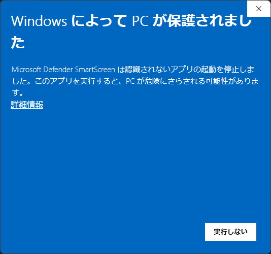
 

▲ もうちょっと枠を大きくするかフォントを小さくすればいいのにと思わせる「最終防衛ライン」

`実行しない` 一択です.

でも, だいたいコツがつかめてきました.
どうせその <ins>詳細情報</ins> でしょう?
つついてみましょう.

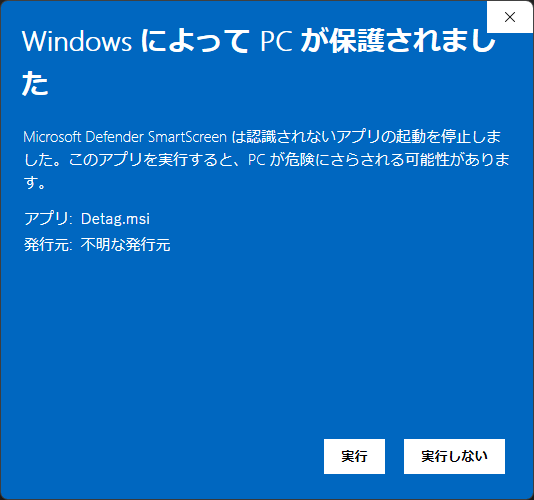
 

▲ その役割の重さの割にはフォントの雰囲気が軽い「最終防衛ライン」

`実行` という選択肢が増えて二択になりました.
 

( 署名は施してあるので「不明な発行元」というのも失礼な話ですが,
「お金を払って認証機関に登録して Microsoft&reg; の名簿に載っている発行元」ではないので, 「不明」なんでしょう. )

長い道のりでしたが, これで最後です.
その `実行` を押しちゃってください.
それでインストーラーが起動します.

インストーラーが起動すると, 最初に出てくるのが下図の状態です.

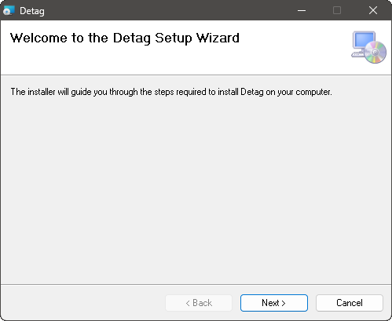
 

▲ 「セット アップ ウィザード」に歓迎しておきながら主語が「インストーラー」のインストーラー

特にどうもしようがないので, すなおに <kbd>Next ></kbd> を押しましょう.
すると下図のようになります.

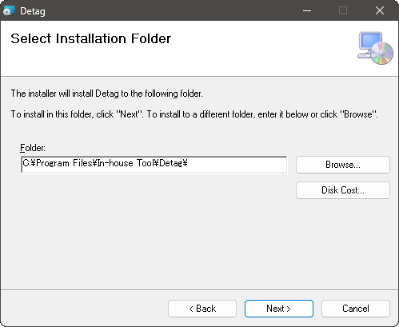
 

▲ 次の主語も「インストーラー」なので自身の自覚は「インストーラー」だと思われるインストーラー

当アプリをインストールする先のフォルダーを指定する段階です.

デフォルトで提示されているフォルダーがなんか気に入らない方は,
直接フォルダー名を打ち込むなり, <kbd>Browse...</kbd> ボタンを押してフォルダーを選ぶダイアログを出して操作するなり,
お好みのフォルダーを指定します.

そして, <kbd>Next ></kbd> を押します.
すると下図のようになります.

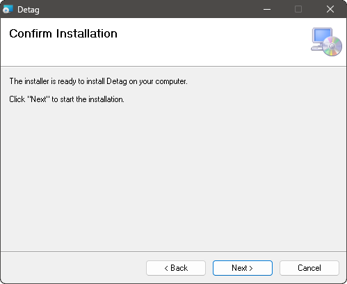
 

▲「インストーラーは準備万端」だと促すインストーラー

「インストールを始めるには "Next" をクリックしてください。」的なことを言っているので,
<kbd>Next ></kbd> を押します.

するとインストーラーが動き出し, 突然
[UAC](https://learn.microsoft.com/ja-jp/windows/security/application-security/application-control/user-account-control/)
が現われてあなたをびっくりさせます.

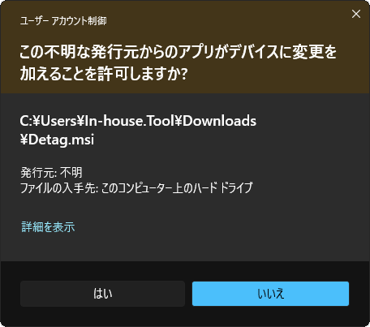
 

▲ 示されるフォルダーパスは人によって異なりますが, そのへんは大人の常識で読み替えてください.

デフォルトが <kbd>いいえ</kbd> なところに嫌がる Windows&reg; の気持ちがうかがえますが,
そんなものは踏みにじって <kbd>はい</kbd> を押しましょう.

すると再びインストーラーが動き出して,
バタバタっと何かした後,
すぐに終わって下記のような表示に落ち着きます.

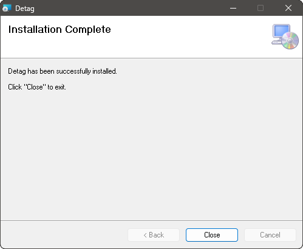
 

▲ もう戻れなくなったインストーラー

いろいろとお手数をおかけしました.
これで <kbd>Close</kbd> ボタンを押せば, インストールは完了です.

スタートメニューの **頭文字 D** のところを見ると,
下記のように `Detag` が紛れ込んでいるはずです.

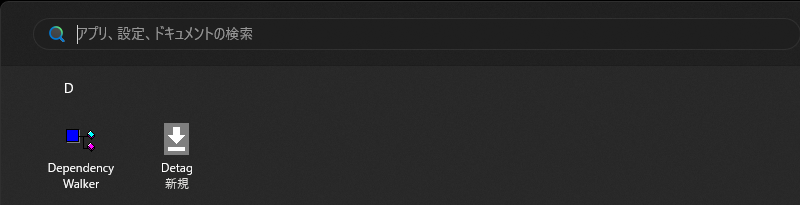

その  をクリックすれば当アプリの起動です.
 

このアイコンは「ぎゅっと圧縮された何か」あるいは「どっかからか落としてきた何か」とでもお考えください.
当方の絵心ではこの程度が限界です.

## [起動してみたら「mfc140u.dll が見つからない」とか言われた場合](#installation)

「よし、インストールできた！」と勇んで起動してみると,
人によっては ( 正確には PC によっては ), 下図のようなダイアログが現われて,
何か深刻な問題が起きたようなことを告げてきます.

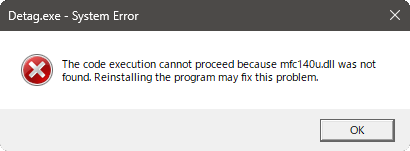
 

( 「システムエラー」ですもんね.
「システム」で「エラー」とか言われたら, そりゃパニックですよ. この言い方, どうにかなりません? )

でもこれって,
[よくある話](https://www.google.com/search?q=mfc140u.dll+が見つからない)なんですよ.

なんでよくある話なのかというと,
みなさん「`.dll` として切り離せるものは `.exe` から切り離して」提供しているからです.
なんでそんな「外付けの `.dll` が要る `.exe`」なんて意地悪な構成にするのかというと, 下記の利点があるからです.

* オブジェクトサイズが小さくなるので, SSD ( HDD ) の容量節約になる.
* 同じ DLL を使う複数のプロセスが居る場合は DLL が共有されるので, メモリーの節約にもなる.
* Microsoft&reg; さんの DLL には Microsoft&reg; さんがセキュリティー更新をかけてくれるので, 今後も安心.

というわけで, その DLL をくれる Microsoft&reg; さんのサイトは
[こちら](https://learn.microsoft.com/ja-jp/cpp/windows/latest-supported-vc-redist)です.
なにやらしちめんどくさそうなことがごちゃごちゃと書いてありますが,
当アプリの場合, 足りない DLL を補うのは,
[`最新の Microsoft Visual C++ 再頒布可能パッケージ バージョン`](https://learn.microsoft.com/ja-jp/cpp/windows/latest-supported-vc-redist#latest-supported-redistributable-version)
 のところにある
[https://aka.ms/vc14/vc_redist.x64.exe](https://aka.ms/vc14/vc_redist.x64.exe)
です.
 

( `X86` のじゃないですよ. `X64` のですからね. )

このリンクをつつくと, 
例によってダウンロードの手続きが始まりますが,
当アプリのようにアヤしいものではないので, わりとすなおに `Open` できます.
すると下図のようになんだかボタンの位置がズレたダイアログが出てきて「だいじょうぶか、こいつ?」と思わせなくもないですが,
だいじょうぶなんです.

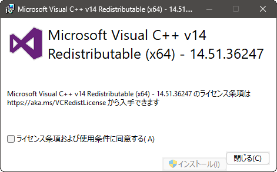
 

▲[以前](../../../../ChkMails/blob/main/Installation.md#起動してみたらmfc140udll-が見つからないとか言われた場合)の「vs/17」名義から「vc14」名義に改められた VC++ v14 再頒布パッケージの, ボタンのズレが改められていないインストーラー

「ライセンス条項」とやらに合意 ( チェックボックスを☑ ) すると,
なんだか位置がズレているボタンがイネーブルになって,
インストールできるようになります.

しかしその「ライセンス条項」,
以前はこのダイアログの中に書いてあってその場で読めたものですが,
最近のは「https://aka.ms/VCRedistLicense にあるから勝手に読んでね。」形式に改められています.
 

……なんか投げやりになったなあ.

「どうせ読むやつなんか居ないだろ。」と言わんばかりのその態度が気に食わないので,
言われた URL にわざわざ行ってみると,
アメリカ語で書かれた ( 巻末のカナダ向け補足のみフランス語 ) 長い文章がフレーム構造の中に納められているので,
スクロールバーが二重になって読みづらくなっているページに出てきます.
 

[以前の](../../../../ChkMails/blob/main/Installation.md#起動してみたらmfc140udll-が見つからないとか言われた場合)も読みづらいと感じたけど,
まだその場でしかも日本語で説明しようとしているだけマシだったのか…….

`ライセンス条項および使用条件に同意する(A)` に☑すると押せるようになる <kbd>インストール(I)</kbd> ボタンを押すと,
すんなりと, しかもタダで, 足りなかった `mfc140u.dll` とやらが, あなたの PC にもインストールされます.

お手数をおかけしますが, お付き合いください. どうやらこれが最善の提供形態のようなんです.

この「DLL のインストール」が無事終わったら,
再び `Detag` を起動してみてください.
こんどこそ動くはずです.
下図のような画面が出てきます.

その後どうすればいいのかに関しては, [本編の説明](../../../#操作)をご参照ください.

## [アンインストール](#installation)

「アンインストールの方法が判っていないものをインストールしたくない！」というお考えをお持ちの方に向けて,
( ご立派なお考えです. )
アンインストールの方法もここに記しておきます.
一言で言えば「普通にアンインストールできます」.

まずは「設定」の「アプリ」で「インストールされているアプリ」を開きます.

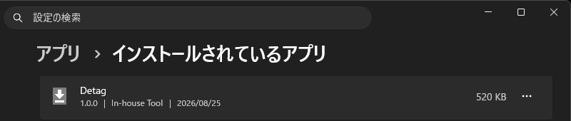

で, `Detag` のところの `...` にマウスポインターを合わせると,
`その他のオプション` というのが浮かび上がってきます.

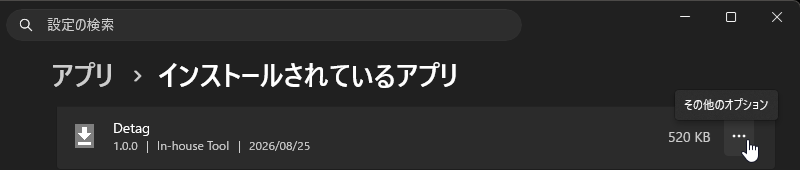

`その他のオプション` をつつくと, `変更` か `アンインストール` かという二択が示されます.

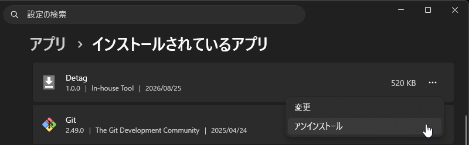

`アンインストール` を選ぶと, 確認のポップアップが現れます.

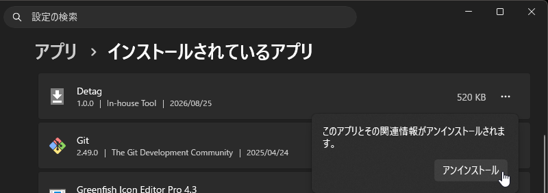

`アンインストール` をつつくと, 
[UAC](https://learn.microsoft.com/ja-jp/windows/security/application-security/application-control/user-account-control/)
が現われてあなたをびっくりさせます.

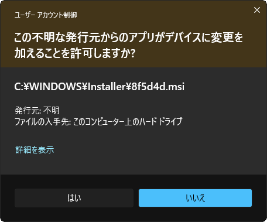
 

▲ 示されるフォルダーパスは人によって異なりますが, そのへんは大人の常識で読み替えてください.

ここで <kbd>はい</kbd> をクリックすると,
Detag はあなたの PC からアンインストールされます.

* ここで上の図を見て「あれ？ `C:\WINDOWS\` の下に `Installer\` なんてフォルダーあったっけ？」と疑問に思った方, 
そんな細かいことを気にして生きていて楽しいですか?
* ここで Explorer に `C:\WINDOWS\Installer` とわざわざ手入力してフォルダーの存在を確かめた方, 
そんな風に人が隠していることを暴いて楽しいですか?
